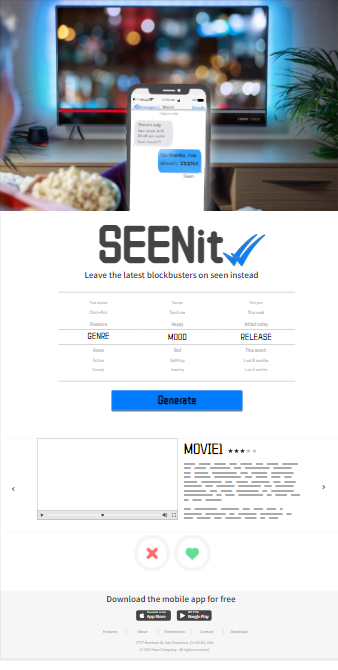

SEENit! was created as the group project requirement for the Code First Girls Degree - Summer 2023 Software Stream Cohort.

## CONTENTS

* [User Experience](#user-experience)
  * [Project Goals](#project-goals)
  * [User Stories](#user-stories)

* [Design](#design)
  * [Imagery](#imagery)
  * [Wireframes](#wireframes)

* [Future Implementations](#future-implementations)
* [Problems Encountered](#problems-encountered-and-changes-made)

* [Technologies Used](#technologies-used)
  * [Languages Used](#languages-used)
  * [Frameworks, Libraries and Packages Used](#frameworks,-libraries-and-packages-used)
  * [Programs Used](#programs-used)
  * [Movies API](#Movies-API)
  
* [Instructions on how to run the app](#instructions-on-how-to-run-the-app)
  * [Local Development](#local-development)
    * [How to Fork](#how-to-fork)
    * [How to Clone](#how-to-clone)
    * [Installng Packages/Modules/Libraries](#installng-packages/podules/pibraries)
    * [App Set-up](#App-Set-up)
    * [API Keys](#api-keys)
    * [Running the app](#running-the-app)

* [Testing](#testing)
  
* [Credits](#credits)
  * [Content](#content)
  * [Acknowledgments](#acknowledgments)

- - -

## User Experience

### Project Goals

The primary goal of SEENit! Is to simplify the movie-watching experience for users by aiming to make the process of finding and watching films more enjoyable and efficient. 

The project’s objective is to provide users with a personalised recommendation based on user preferences. This feature limits the amount of scrolling and indecisiveness by presenting the user with options that align with their interests. 

The project aims to offer an effective movie search mechanism, allowing users to find movies based on categories such as; genres, actors, keywords. This helps users to quickly narrow down their choice of films depending on what they’re in the mood for.

### User Stories

#### __Target Audience__

The target audience for Seenit! is anyone that enjoys watching movies and would like to search for movies based on genre, decade, keywords or any combinaton of the searches mentioned. Users will also be able to check with movies are currently playing in cinemas. The other target audience for the Seenit! app are people who aimlessly scroll, looking for things to watch on streaming services. Once a search for the movie is done, the user will be able to identify quickly which streming service is currently showing the movie in question.

#### __First Time Visitor__

As a first time user of the site we want to be able to:

* Search for movie recommendations based on genre.
* Search for movie recommendations based on decade released.
* Search for movie recommendations based on keywords.
* Search for movie recommendations that currently appear in cinemas.

#### __Returning Visitor__

As a returning user of the site we want to be able to use the app in the same way in which a first time user interacts with the app.

- - -

## Design

The design features bold, primary colours and clean, sleek shapes which are easy on the eye. These should be equally visually appealing in a range of viewing scenarios and devices. 

Integral to the architecture are API integrations, prominently featuring the The Movie Database API for comprehensive movie information as well as the ability to view streaming services broadcasting a user-selected film. The recommendation engine employs user preferences to generate precise movie recommendations, displaying clearly and uniformly on the interface. In addition, the key information provided by the external API, each movie displayed on the interface is accompanied by a movie poster, movie name, and movie community rating to inform user choice.


### Imagery

As the site is for people who love to watch movies, we kept the imagery throughout the site to the theme of movies.

All images of the movies have been requested through the [The Movie DB API](https://api.themoviedb.org/3).

### Wireframes

Wireframes were created to visualise what the front-end would look like for the user:



- - -

### Future Implementations

In future implementations we would like to:

* Create user profiles so that data and movie recommendations can be saved.
* Add, change and reset password functionality to the profile section.
* Give users the option to delete their account in the profile section.
* Store user profiles in a relational database.
* Display showtimes and locations of cinemas for movies showing in theatres.
* Give users the ability to create watchlists.


### Problems encountered and changes made to initial brief

The initial brief included the use of a showtimes API to be able to list the cinema listings, times and locations of where the movie is being shown. Unfortunately, after enquiries with the API provider, due to the project not being classed as 'commercial use', there was a cost invloved with having access and making calls to the API.

Due to this issue, we discussed as a group and decided to change the brief slightly. Instead of showing cinema listings, it was decided that TMDB API could also be used to show users which streaming service they could use to view the movie that they had searched for.


## Technologies Used

### Languages Used

HTML, CSS, Javascript, Python

### Frameworks, Libraries and Packages Used

* [Flask](https://pypi.org/project/Flask/) - A micro framework.

* Requests

* Unittest (Testing framework)

### Programs Used

[Pip](https://pypi.org/project/pip/) - Tool for installing python packages.

[Git](https://git-scm.com/) - For version control.

[Github](https://github.com/) - To save and store the files for the website.

[Google Chrome Dev Tools](https://developer.chrome.com/docs/devtools/) - To troubleshoot and test features, solve issues with responsiveness and styling.

### Movies API

We have used the TMDB API to allow users of the site to search for movie recommendations based on various searches.

We made use of the [The Movie DB API](https://api.themoviedb.org/3) documentation to learn how to fetch data from the API. The documentation also allowed us to amend our request to only fetch the fields we plan to use on the site. This reduces the amount of data returned and will speed up server processing.

As we are only using the API to search for the requests to the API contain the API key, the search term the user has created and the fields that we would like to be returned. We have chosen to only receive the movie title, genre, description and thumbnail of the movie. 

### Instructions on how to run the app

### Local Development

#### How to Fork

To fork the repository:

1. Log in (or sign up) to Github.

2. Go to the repository for this project, [Seenit!](https://github.com/GITHUBLINK).

3. Click the Fork button in the top right corner.

#### How to Clone

To clone the repository:

1. Log in (or sign up) to GitHub.

2. Go to the repository for this project, [Seenit!](https://github.com/GITHUBLINK).

3. Click on the code button, select whether you would like to clone with HTTPS, SSH or GitHub CLI and copy the link shown.

4. Open the terminal in your code editor and change the current working directory to the location you want to use for the cloned directory.

5. Type the following command in the terminal (after the git clone you will need to paste the link you copied in step 3 above):

    ```bash
    git clone { & THE LINK FROM STEP 3 }
    ```

### Installng Packages/Modules/Libraries

You can install the packages required in two ways. 

1. Install the packages from the requirements.txt file by running the following command in the Terminal:

    ```bash
    pip3 install -r requirements.txt
    ```
  If you are running a different version of Pythond, you can use pip instead of pip3.

OR:

2. Using your IDE (PyCharm, or your preferred IDE) - in the Python terminal, type the following commands to install the required packages/modules/libraries individually to run the app:

```
pip install flask
pip install flask-cors
pip install requests
pip install jsonify
```
If you are running different version of Python, you may need to run the followiing commands instead:

```
pip3 install flask
pip3 install flask-cors
pip3 install requests
pip3 install jsonify
```

### App Set-up

### API Keys
Due to the use of an API, API keys are required to run the app. You can do this by going through the following steps:
-  1. Create an account by signing up at the [TMDb website](https://www.themoviedb.org/).
-  2. Log in and navigate to account settings.
-  3. In your account settings, go to the API section and click on the link to request an API Key.
-  4. Provide information regarding how you plan to use the API.
-  5. After agreeing to their T&Cs, generate the API Key.
-  6. The API key will then need to be inputted into the code at the top of the app.py and the utils.py files:
```
API_KEY = "your_api_key_will_go_here"
```
### Running the app

In the IDE (Pycharm):

1. Run the app.py file (this can be done by right-clicking the app.py file and select 'Run', or by clicking the green 'Run' button).

2. Once the app is running, right-click on index.html and navigate to Open in Broswer (it can run as a preview in PyCharm if you so wish). 

- - -

## Testing

Information regarding testing can be found in the project documentation.

- - -

## Credits

### Content

Content for this project was written by Leah Jones, Dana Ciobotaru, Phoebe Cowan, Ella Rees, Anni Sutt and Delyth Jennings. 

The film descriptions, images, rating and streaming services information were provided through the [The Movie DB API](https://api.themoviedb.org/3).

### Acknowledgments

We would like to acknowledge the following people who helped us along the way in completing this project:

* Our families for their patience while we worked on this project.
* Hamed Pour and Jack Jorgensen for being excellent instructors on the CFG Degree course.
* Fatihah and Abilash - the assistant instructors on our course for all the feedback on the homework and assessments, which in turn, helped us progress with our learning.
* Hope - our project instructor for her help during the last few weeks of the course.
